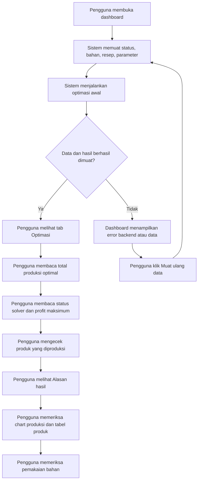
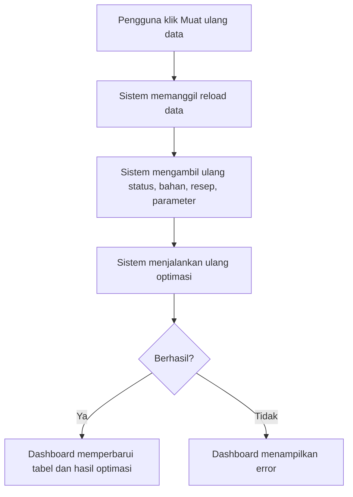
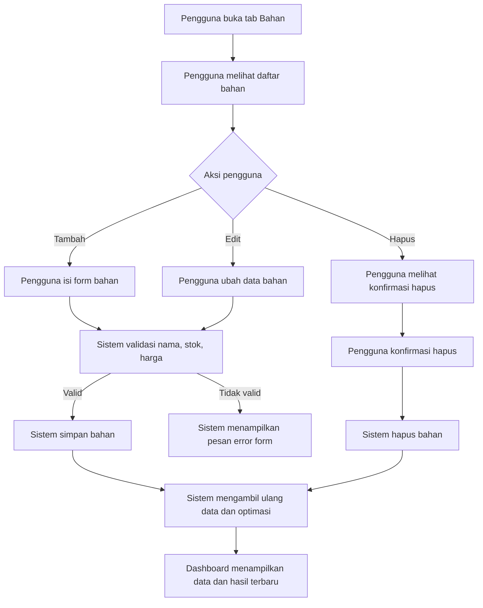
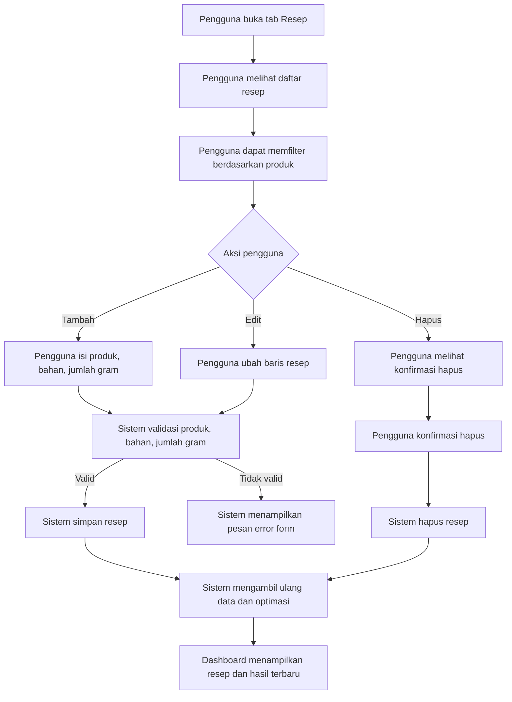
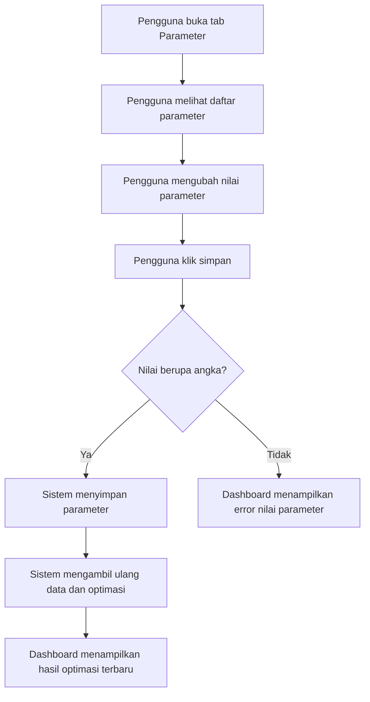
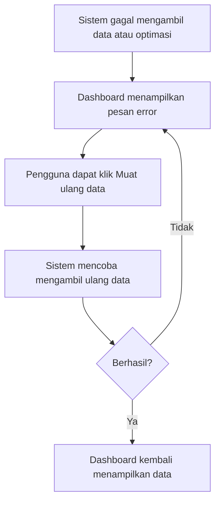

# User Flow: Dashboard Optimasi Produksi Bakery

## Tujuan Flow

Dashboard ini membantu pengguna memahami hasil perhitungan optimasi produksi bakery berdasarkan data bahan, resep, dan parameter yang aktif. Fokus flow adalah membaca hasil algoritma, memeriksa data input, mengubah data bila perlu, lalu melihat ulang hasil perhitungan.

## Aktor Utama

- **Admin**: membuka dashboard untuk memahami hasil optimasi dan memastikan data pendukungnya jelas.
- **Mahasiswa / operator simulasi**: mengubah bahan, resep, atau parameter untuk melihat dampaknya pada hasil produksi optimal.

## Struktur Layar

- **Header**: judul dashboard, status data, tombol muat ulang data.
- **Ringkasan status**: update terakhir, total produk, total bahan, margin.
- **Tabs utama**:
  - `Optimasi`
  - `Bahan`
  - `Resep`
  - `Parameter`

## Flow Utama: Membaca Hasil Optimasi

### Detail Langkah

1. Pengguna membuka dashboard.
2. Sistem mengambil data dari backend:
   - status data
   - bahan
   - resep
   - parameter
3. Sistem menjalankan optimasi awal.
4. Pengguna membaca hasil utama:
   - total produksi optimal
   - status solver
   - profit maksimum
   - jumlah produk yang diproduksi
5. Pengguna melihat interpretasi singkat:
   - bahan pembatas
   - profit per unit tertinggi
   - produk yang tidak diproduksi
6. Pengguna mengecek detail:
   - chart produksi optimal
   - tabel ringkasan produk
   - tabel pemakaian bahan

## Flow Muat Ulang Data

### Tujuan

Flow ini dipakai ketika pengguna ingin memastikan data dari backend dan Google Sheets sudah paling baru.

## Flow Kelola Bahan

### Validasi

- Nama bahan tidak boleh kosong.
- Stok harus angka nol atau lebih.
- Harga harus angka nol atau lebih.

## Flow Kelola Resep

### Validasi

- Nama produk tidak boleh kosong.
- Bahan harus dipilih.
- Jumlah gram harus lebih besar dari nol.

## Flow Ubah Parameter

### Catatan

Parameter yang paling relevan saat ini adalah `margin`. Perubahan nilai parameter akan memicu pengambilan ulang data dan optimasi ulang setelah berhasil disimpan.

## Flow Error dan Empty State

Empty state muncul ketika:

- hasil optimasi belum tersedia
- tabel bahan kosong
- tabel resep kosong atau filter tidak menemukan baris
- parameter belum tersedia
- pemakaian bahan belum bisa dihitung

## Flow Mobile

Pada layar kecil:

1. Header, status, dan tabs disusun satu kolom.
2. Tabel berubah menjadi baris bertumpuk dengan label dan nilai.
3. Aksi edit dan hapus tetap berada di baris data yang sama.
4. Chart, ringkasan, dan interpretasi hasil turun menjadi satu kolom.

Tujuannya agar pengguna tetap bisa membaca data tanpa horizontal scroll dan tanpa text overlap.

## Acceptance Criteria Flow

- Pengguna bisa memahami hasil optimasi dari tab pertama tanpa membuka tab lain.
- Pengguna bisa menelusuri data input melalui tab Bahan, Resep, dan Parameter.
- Setelah create, update, delete, reload, atau save parameter, dashboard memperbarui data dan menjalankan ulang optimasi.
- Jika backend bermasalah, pengguna melihat pesan error yang jelas.
- Semua flow tetap tersedia di desktop dan mobile.
